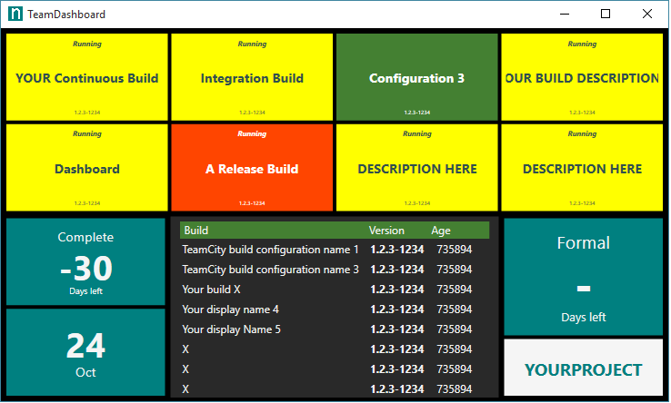

# TeamDashboard 

A Windows application (C# WPF) wall team/systems dashboard. This project is something I'm using but is not mature.

# Features ##

- Tiles:
 - TeamCity last/current build configuration monitor
 - TeamCity list of available (last successful) builds
 - Days remaining countdown
 - Current date
 - Message
 - Webbrowser
- Drag and drop tile insertion
- Drag and drop tile positioning
- Quick configuration in UI
- Tiles can span multiple rows and columns

# Quick start #

- Install & run
- Press INSERT to add a new tile and drag and drop into position
- Double click on a tile to configure it

