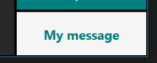
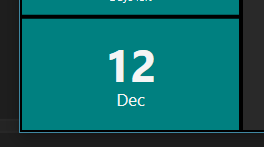

# TeamDashboard 

A Windows application (C# WPF) wall team/systems dashboard. This project is something I'm using but is not mature.

# Features ##

- Tiles:
 - TeamCity last/current build configuration monitor
 - TeamCity list of available (last successful) builds
 - Days remaining countdown
 - Today's date
 - Message
 - Webbrowser
 - Image file watcher
- Drag and drop tile insertion
- Drag and drop tile positioning
- Quick configuration in UI
- Tiles can span multiple rows and columns

# Quick start #

- Install & run
- Press INSERT to add a new tile and drag and drop into position
- Double click on a tile to configure it

# Tiles #

## Message

The message tile displays a text message. Useful of adding labels to the dashboard such as your team's name.

To add a message tile:

1. Press INSERT, the insert pane will appear.
2. Drag and drop the message tile entry to where you want the tile.
3. To change the message double click on the tile.

## Today's date tile

The today's date tile displays the current date.

To add a date tile:

1. Press INSERT, the insert pane will appear.
2. Drag and drop the today's date tile entry to where you want the tile.

## TeamCity tiles

### Build configuration

The TeamCity build configuration tile displays the status of a current build, or if not build is running, the configuration's last build.

After a successful build:

 tile")

After a failed build:

 tile")

While building, no failure:

 tile")

To add a build tile:

1. Press INSERT, the insert pane will appear.
2. Drag and drop the build tile entry to where you want the tile.
3. Double click on the tile to configure it.

### Build agent

The TeamCity build agent tile displays an build agents state.

THIS TILE IS A WORK IN PROGRESS

To add a build agent tile:

1. Press INSERT, the insert pane will appear.
2. Drag and drop the today's date tile entry to where you want the tile.
3. Double click on the tile to configure it.

